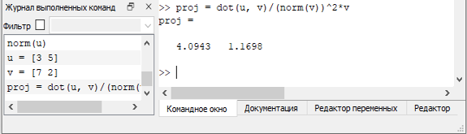

---
## Front matter
lang: ru-RU
title: Лабораторная работа №3
subtitle: 'Введение в работу Octave'
author: 'Румянцева Александра Сергеевна'
date: 14 октября, 2022

## Formatting
toc: false
slide_level: 2
theme: metropolis
mainfont: PT Serif
romanfont: PT Serif
sansfont: PT Serif
monofont: PT Serif
header-includes: 
 - \metroset{progressbar=frametitle,sectionpage=progressbar,numbering=fraction}
 - '\makeatletter'
 - '\beamer@ignorenonframefalse'
 - '\makeatother'
aspectratio: 43
section-titles: true
---

## Цель работы

Познакомиться с интерфейсом Octave.

## Простейшие операции

На скриншоте продемонстрировано, как Octave можно использовать в качестве простейшего калькулятора.

{ #fig:001 width=30% }

Также можно выполнять и другие операции, например, задать матрицу.

{ #fig:002 width=35% }

## Операции с векторами

Если задать два вектора, то в Octave можно производить, например, операцию сложения векторов (первый скриншот) или производить векторное умножение (второй скриншот).

{ #fig:003 width=20% }

{ #fig:004 width=20% }

## Вычисление проектора

Также, если задать, например, два вектора-строки, то можно вычислить проекцию одного вектора на другой.

{ #fig:005 width=75% }

## Матричные операции

В Octave можно осуществлять матричные операции, например, находить произведение матриц (первый скриншот), обратную матрицу (второй скриншот).

{ #fig:006 width=40% }

{ #fig:007 width=40% }

## Матричные операции

Можно также найти и определитель матрицы.

{ #fig:008 width=50% }

## Построение графиков

В Octave можно, например, построить график функции sin(x) на интервале [0, 2π], выделять его красным цветом, добавлять сетку, подпись и легенду.

{ #fig:009 width=40% } 

## Построение графиков

Кроме того, на одном чертеже можно строить большее число графиков, например, два.

{ #fig:010 width=45% }

## График y=x^2^sin(x)

Можно построить и более сложный график уже с использованием поэлементного возведения в степень и поэлементного умножения.

{ #fig:011 width=40% }

## Сравнение циклов и операций с векторами

Сравним эффективность работы с циклами и операций с векторами. Для этого вычислим следующую сумму 3.1 с помощью цикла (рисунок 13) и с помощью операций с векторами (рисунок 14).

{ #fig:012 width=60% }

## Сравнение циклов и операций с векторами

{ #fig:013 width=55% }

{ #fig:014 width=55% }

Во втором случае сумма вычисляется значительно быстрее.

## Результат лабораторной работы

Я познакомилась с некоторыми простейшими операциями в Octave.
