---
# Front matter
lang: ru-RU
title: 'Лабораторная работа 3.'
subtitle: 'Тема лабораторной работы: Введение в работу с Octave'
author:
- "Студент: Румянцева Александра Сергеевна, 1132223493"
- "Группа: НПМмд-02-22"
- "Преподаватель: Кулябов Дмитрий Сергеевич,"
- "д-р.ф.-м.н., проф."
date: "Москва 2022"

# Formatting
toc-title: 'Содержание'
toc: true # Table of contents
toc_depth: 2
lof: true # List of figures
lot: true # List of tables
fontsize: 12pt
linestretch: 1.5
papersize: a4paper
documentclass: scrreprt
polyglossia-lang: russian
polyglossia-otherlangs: english
mainfont: PT Serif
romanfont: PT Serif
sansfont: PT Sans
monofont: PT Mono
mainfontoptions: Ligatures=TeX
romanfontoptions: Ligatures=TeX
sansfontoptions: Ligatures=TeX,Scale=MatchLowercase
monofontoptions: Scale=MatchLowercase
indent: true
pdf-engine: lualatex
header-includes:
  - \linepenalty=10 # the penalty added to the badness of each line within a paragraph (no associated penalty node) Increasing the value makes tex try to have fewer lines in the paragraph.
  - \interlinepenalty=0 # value of the penalty (node) added after each line of a paragraph.
  - \hyphenpenalty=50 # the penalty for line breaking at an automatically inserted hyphen
  - \exhyphenpenalty=50 # the penalty for line breaking at an explicit hyphen
  - \binoppenalty=700 # the penalty for breaking a line at a binary operator
  - \relpenalty=500 # the penalty for breaking a line at a relation
  - \clubpenalty=150 # extra penalty for breaking after first line of a paragraph
  - \widowpenalty=150 # extra penalty for breaking before last line of a paragraph
  - \displaywidowpenalty=50 # extra penalty for breaking before last line before a display math
  - \brokenpenalty=100 # extra penalty for page breaking after a hyphenated line
  - \predisplaypenalty=10000 # penalty for breaking before a display
  - \postdisplaypenalty=0 # penalty for breaking after a display
  - \floatingpenalty = 20000 # penalty for splitting an insertion (can only be split footnote in standard LaTeX)
  - \raggedbottom # or \flushbottom
  - \usepackage{float} # keep figures where there are in the text
  - \floatplacement{figure}{H} # keep figures where there are in the text

  - \usepackage{titling}
  - \setlength{\droptitle}{-9em}
  - \pretitle{\begin{center}
      \textbf{РОССИЙСКИЙ УНИВЕРСИТЕТ ДРУЖБЫ НАРОДОВ}\\
      \textbf{Факультет физико-математических и естественных наук}\\
      \textbf{Кафедра прикладной информатики и теории вероятностей}
      \vspace{9cm}
      \LARGE\\}
  - \posttitle{\vskip 1em \Large \emph{\textit{Дисциплина$:$ Научное программирование}} \end{center}}
  - \preauthor{\vskip 3em \begin{flushright} \large \begin{tabular}[t]{c}}
  - \postauthor{\end{tabular}\par\end{flushright} \vfill \vskip 5em}
---

# Цель работы

Познакомиться с интерфейсом Octave.

# Теоретические сведения

Octave является свободной реализацией языка MATLAB. Графический интерфейс Octave похож на графический интерфейс MATLAB.

Язык MATLAB был разработан Кливом Моулером (англ. Cleve Moler) в конце 1970-х годов. Целью разработки служила задача дать студентам факультета возможность использования программных библиотек Linpack и EISPACK без необходимости изучения языка FORTRAN. Язык распространился среди других университетов и был с большим интересом встречен учёными, работающими в области прикладной математики. MATLAB широко используется для выполнения инженерных и научных расчётов, а также в образовании. В 1984 году была основана компания The MathWorks для коммерциализации MATLAB.

Вся теоретическая часть по использованию интерфейса Octave была взята из инструкции по лабораторной работе №3 на сайте [1]

# Задание

Выполните работу и задокументируйте процесс выполнения.

# Выполнение лабораторной работы

**1. Простейшие операции**

- Включим журналирование сессии (см. рис. 1).

   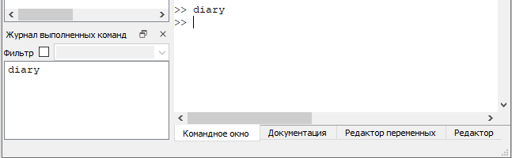{ #fig:001 width=70% }

- Продемонстрируем, что Octave можно использовать как простейший калькулятор. Для этого вычислим выражение (см. рис. 2).

   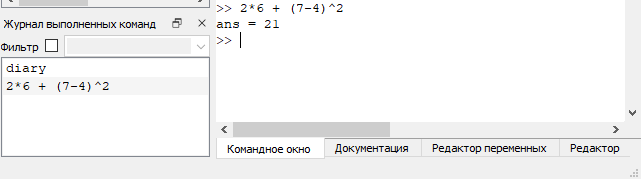{ #fig:002 width=70% }

- Зададим вектор-строку (ковектор) (см. рис. 3).

   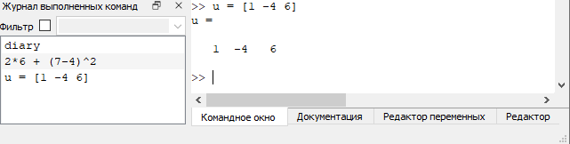{ #fig:003 width=70% }

- Зададим вектор-столбец (вектор) (см. рис. 4).

   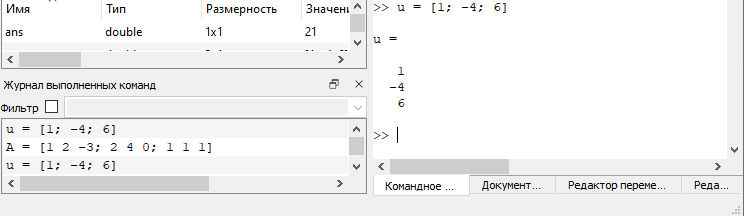{ #fig:004 width=70% }

- Зададим матрицу (см. рис. 5).

   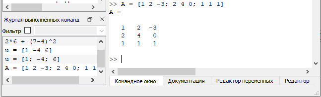{ #fig:005 width=70% }

**2. Операции с векторами**

- Зададим два вектора-столбца (см. рис. 6).

   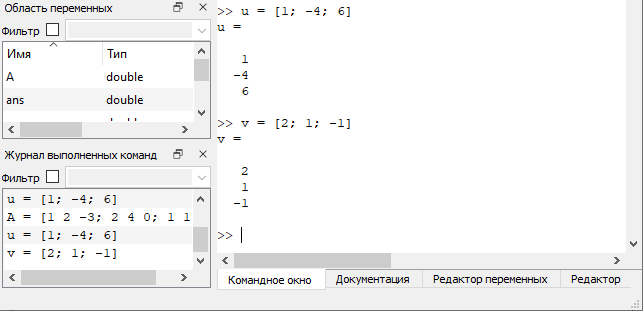{ #fig:006 width=70% }

- Выполним операцию сложения векторов (см. рис. 7).

   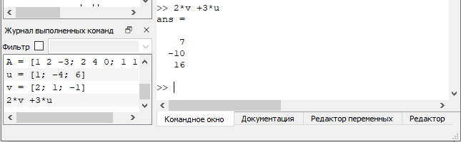{ #fig:007 width=70% }

- Произведем скалярное умножение векторов (см. рис. 8).

   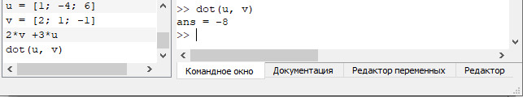{ #fig:008 width=70% }

- Произведем векторное умножение (см. рис. 9).

   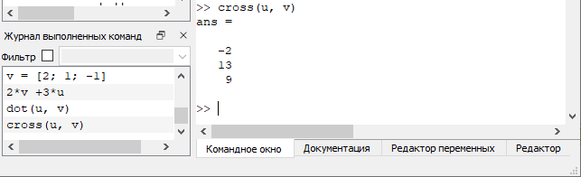{ #fig:009 width=70% }

- Вычислим норму вектора (см. рис. 10).

   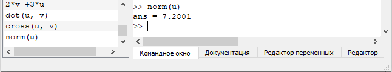{ #fig:010 width=70% }

**3. Вычисление проектора**

- Введем два вектора-строки (см. рис. 11).

   { #fig:011 width=70% }

- Вычислим проекцию вектора u на вектор v (см. рис. 12).

   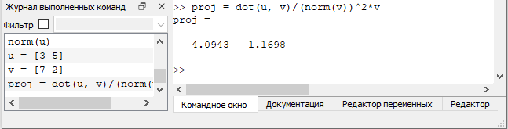{ #fig:012 width=70% }

**4. Матричные операции**

- Введем матрицы A и B (см. рис. 13).

   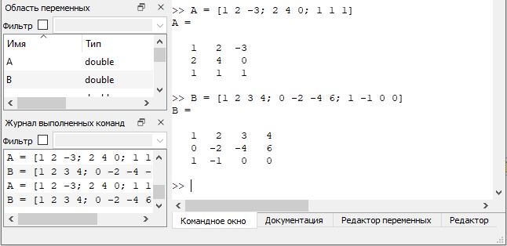{ #fig:013 width=70% }

- Вычислим произведение матриц AB (см. рис. 14).

   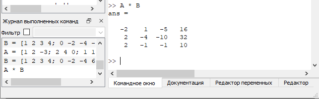{ #fig:014 width=70% }

- Вычислим произведение матриц B^T^A.(см. рис. 15).

   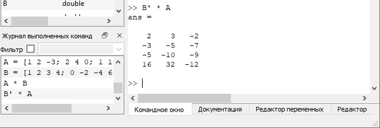{ #fig:015 width=70% }

- Вычислим 2A - 4I, где I есть единичная матрица (см. рис. 16).

   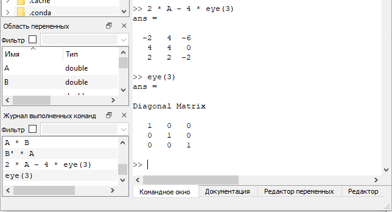{ #fig:016 width=70% }

- Найдем определитель |A| (см. рис. 17).

   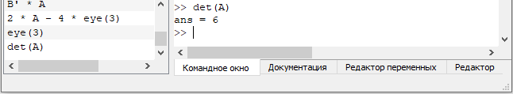{ #fig:017 width=70% }

- Найдем обратную матрицу A^−1^ (см. рис. 18).

   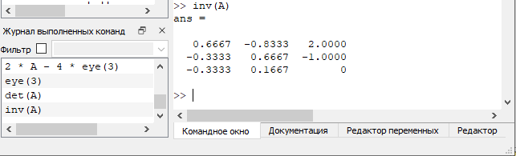{ #fig:018 width=70% }

- Найдем собственные значения матрицы (см. рис. 19).

   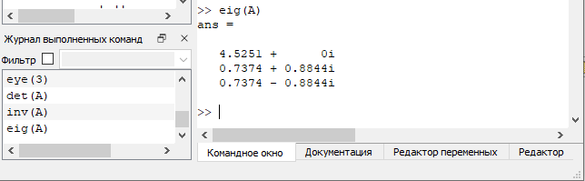{ #fig:019 width=70% }

- Вычислим ранг матрицы (см. рис. 20).

   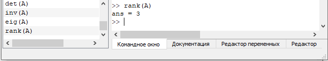{ #fig:020 width=70% }

**5. Построение простейших графиков**

- Построим график функции sin(x) на интервале [0, 2π]. Создадим вектор значений x (см. рис. 21).

   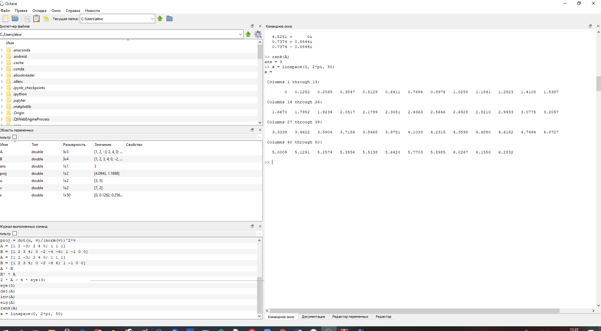{ #fig:021 width=70% }

- Зададим вектор y = sin(x) (см. рис. 22).

   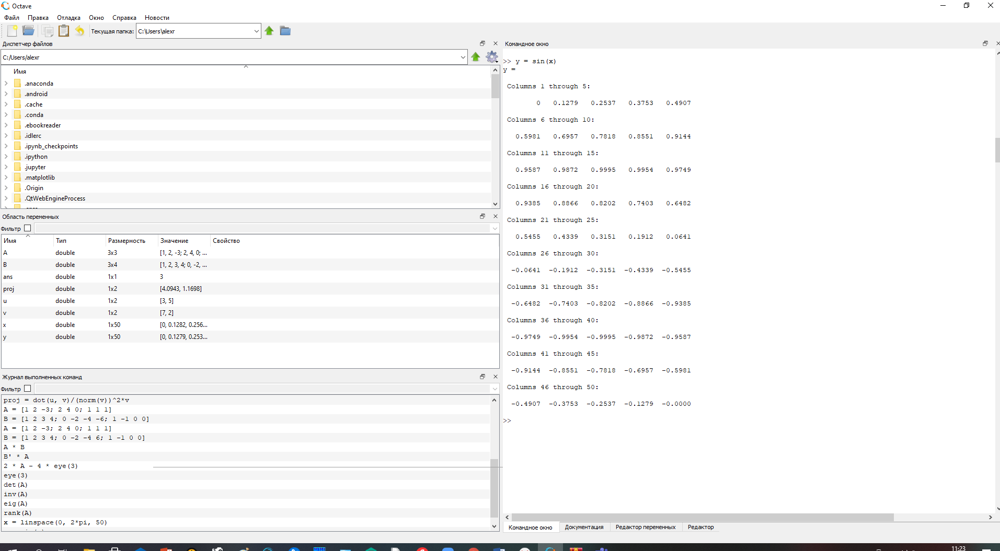{ #fig:022 width=70% }

- Построим график (см. рис. 23, 24).

   { #fig:023 width=70% }

   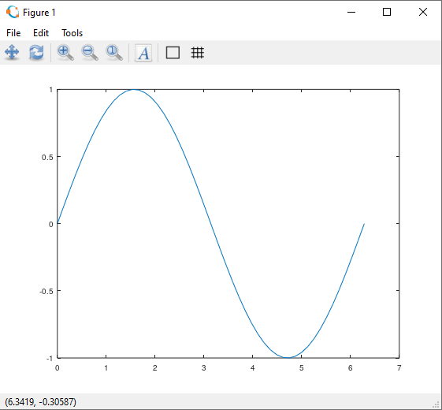{ #fig:024 width=70% }

- Улучшим внешний вид графика. Сначала очистим получившийся график (см. рис. 25). Заметим, что заданные вектора x и y сохранились (см. рис. 26).

   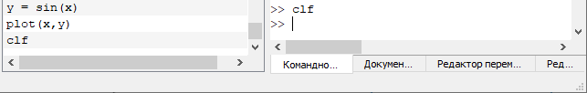{ #fig:025 width=70% }

   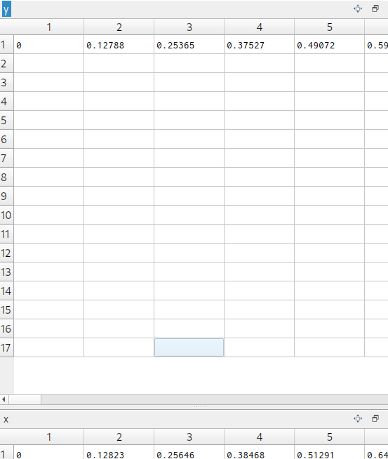{ #fig:026 width=70% }

- Зададим красный цвет для линии и сделаем ее потолще (см. рис. 27, 28).

   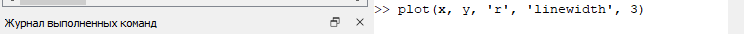{ #fig:027 width=70% }

   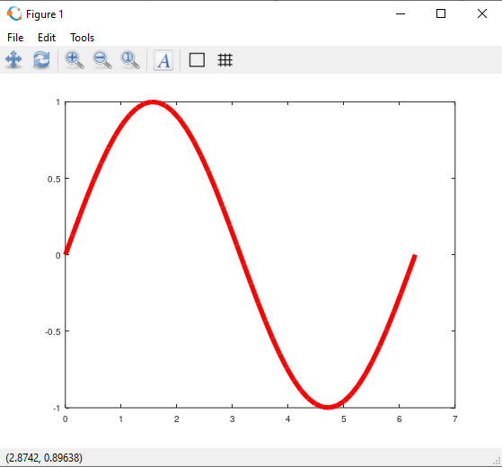{ #fig:028 width=70% }

- Подгоним диапазон осей (см. рис. 29, 30).

   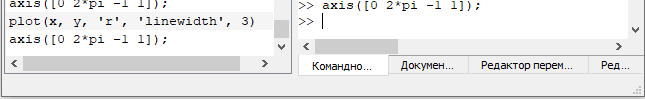{ #fig:029 width=70% }

   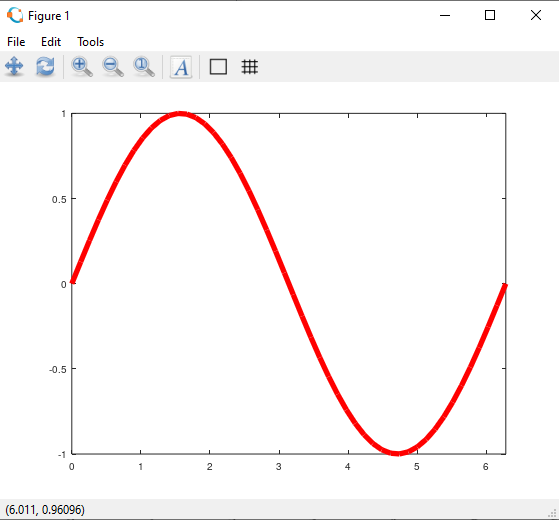{ #fig:030 width=70% }

- Нарисуем сетку (см. рис. 31, 32).

   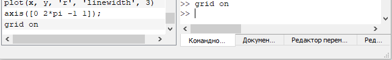{ #fig:031 width=70% }

   { #fig:032 width=70% }

- Подпишем оси (см. рис. 33, 34).

   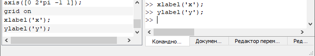{ #fig:033 width=70% }

   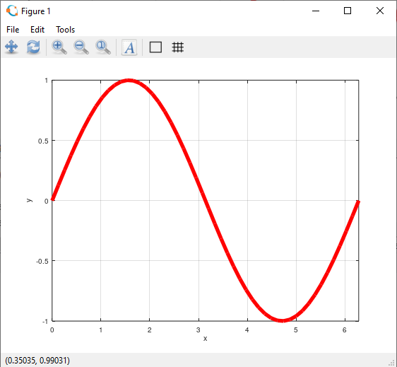{ #fig:034 width=70% }

- Сделаем заголовок графика и зададим легенду (см. рис. 35). В результате получим следующий график (см. рис. 36).

   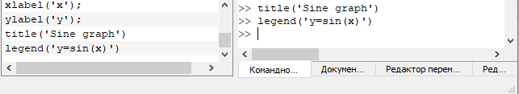{ #fig:035 width=70% }

   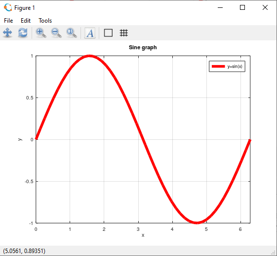{ #fig:036 width=70% }

**6. Два графика на одном чертеже**

- Начертим два графика на одном чертеже. Очистим память и рабочую область фигуры (см. рис. 37).

   { #fig:037 width=70% }

- Зададим два вектора (см. рис. 38).

   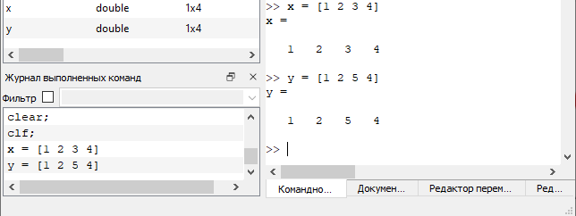{ #fig:038 width=70% }

- Начертим эти точки, используя кружочки, как маркеры (см. рис. 39, 40).

   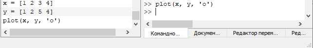{ #fig:039 width=70% }

   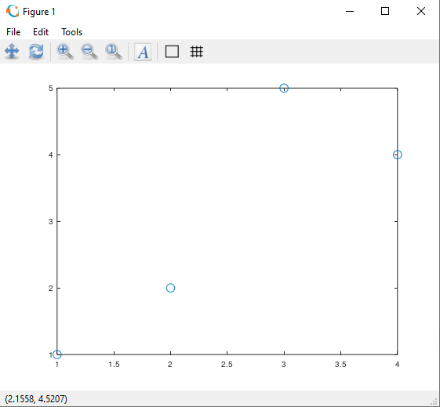{ #fig:040 width=70% }

- Чтобы добавить к нашему текущему графику ещё один, нужно использовать команду hold on (см. рис. 41).

   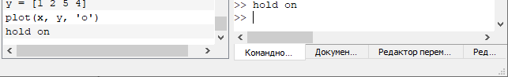{ #fig:041 width=70% }

- Добавим график регрессии (см. рис. 42, 43).

   { #fig:042 width=70% }

   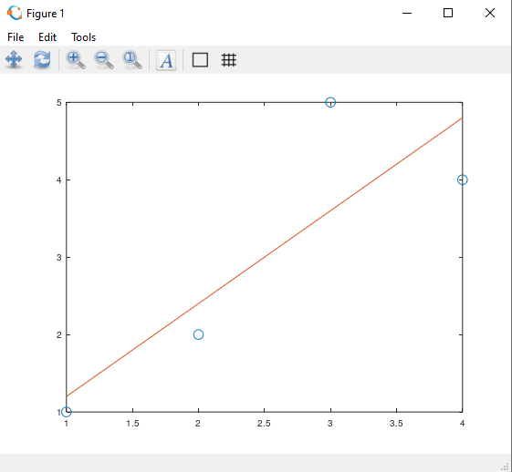{ #fig:043 width=70% }

- Зададим сетку, оси и легенду (см. рис. 44). В результате получим следующий график (см. рис. 45).

   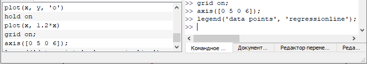{ #fig:044 width=70% }

   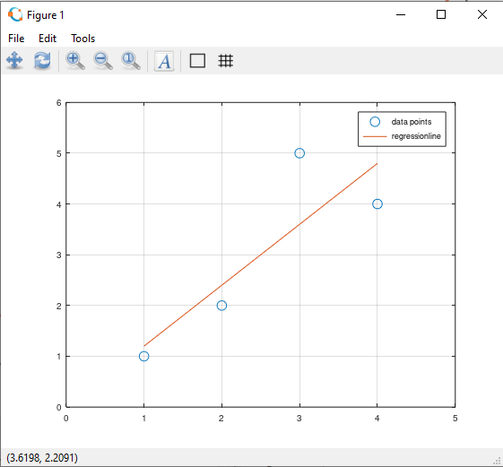{ #fig:045 width=70% }

**7. График y=x^2^sin(x)**

- Очистим память и рабочую область фигуры (см. рис. 46, 47).

   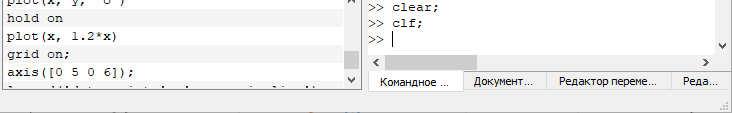{ #fig:046 width=70% }

   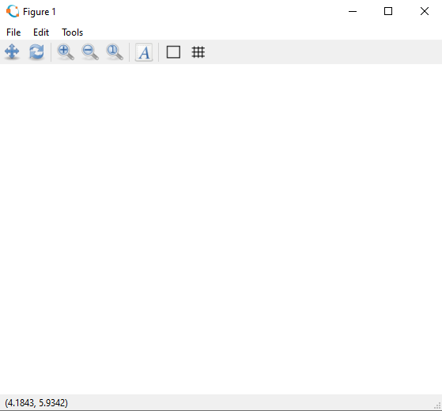{ #fig:047 width=70% }

- Зададим вектор x (см. рис. 48).

   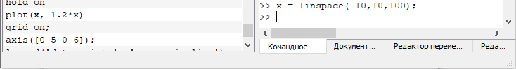{ #fig:048 width=70% }

- Построим график y=x^2^sin(x) (см. рис. 49).

   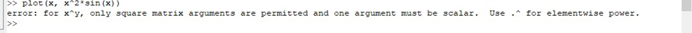{ #fig:049 width=70% }

Ничего не получилось. Действительно, мы задали в выражении матричное умножение. В то время, как нам необходимо поэлементное.

- Построим график y=x^2^sin(x), используя поэлементное возведение в степень .^ и поэлементное умножение (см. рис. 50, 51).

   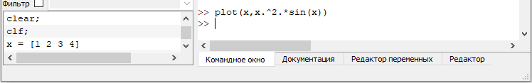{ #fig:050 width=70% }

   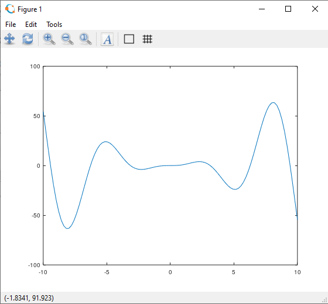{ #fig:051 width=70% }

- Сохраним графики в виде файлов (см. рис. 52).

   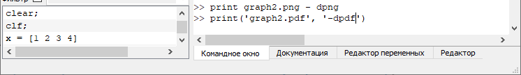{ #fig:052 width=70% }

**8. Сравнение циклов и операций с векторами**

- Сравним эффективность работы с циклами и операций с векторами. Для этого вычислим сумму 3.1 (см. рис. 53).

   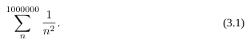{ #fig:053 width=70% }

- Очистим память и рабочую область фигуры (см. рис. 54). Вычислим сумму с помощью цикла, создадим файл loop-for.m, функции tic и toc служат для запуска и остановки таймера (см. рис. 55).

   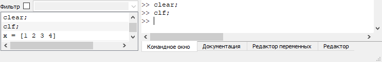{ #fig:054 width=70% }

   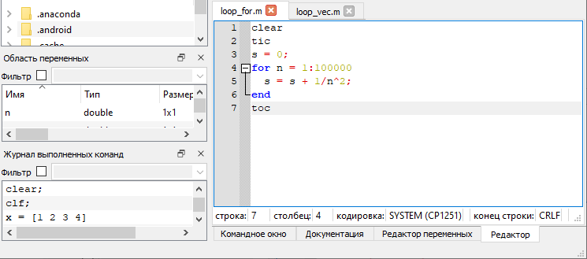{ #fig:055 width=70% }

- Запустим файл loop-for.m (см. рис. 56).

   { #fig:056 width=70% }

- Вычислим сумму с помощью операций с векторами. Создадим файл loop-vec.m (см. рис. 57), запустим его (см. рис. 58).

   { #fig:057 width=70% }

   { #fig:058 width=70% }

Во втором случае сумма вычисляется значительно быстрее.

- Завершим запись в файл (см. рис. 59).

   { #fig:059 width=70% }

# Библиография

1. ТУИС РУДН <https://esystem.rudn.ru/pluginfile.php/1284124/mod_resource/content/4/003-octave-intro.pdf>

# Выводы

Я познакомилась с некоторыми простейшими операциями в Octave.